# Multimodal YouTube: a YouTube player for Everyone

Project for [Biometric Systems](https://sites.google.com/a/di.uniroma1.it/biometric-systems/) and [Multimodal Interaction](https://sites.google.com/a/di.uniroma1.it/multimodal-interaction/) courses (A.Y. 2019/2020).

**Authors**: Irene Cannistraci and Giovanni Ficarra ([@GioFic95]((https://github.com/GioFic95))).

Details are available in the [slides](./slides.pdf) or in the full [report](./report.pdf).

# Introduction
**Multimodal YouTube** is an application designed and developed to be accessible by _deaf users_ and not that combines _biometric_ and _multimodal_ methodologies.
The system was conceived to mimic a video music service that can be controlled using both **speech recognition** and **gesture recognition** methods. An enrolled user is **automatically** identified through a **facial identification** system that can also understand the user's current mood using an **emotion recognition** approach. Then, the specified user will be automatically redirected to a playlist of videos that reflects his/her mood. Then the user will be able to **interact** with the player (_e.g., raise the volume if it is too low or skip the song if it is not appreciated_) by using **hand gestures** and/or **voice commands**. During the enrollment phase, the user can register himself as a deaf user or not. This way, the system will know if it has to redirect the user to an ASL songs playlist. 

# Flow, Architecture and Interaction

1. If not enrolled yet, the user can _register_;
2. If already registered, the user can _log in_ using **face recognition** or typing username and password;
3. The system use the **emotion recognition** and the **deaf information** to redirect the user to the _correct playlist_;
4. The user can **interact** with the player using _buttons_, _gestures_ or _speech_, alternatively.

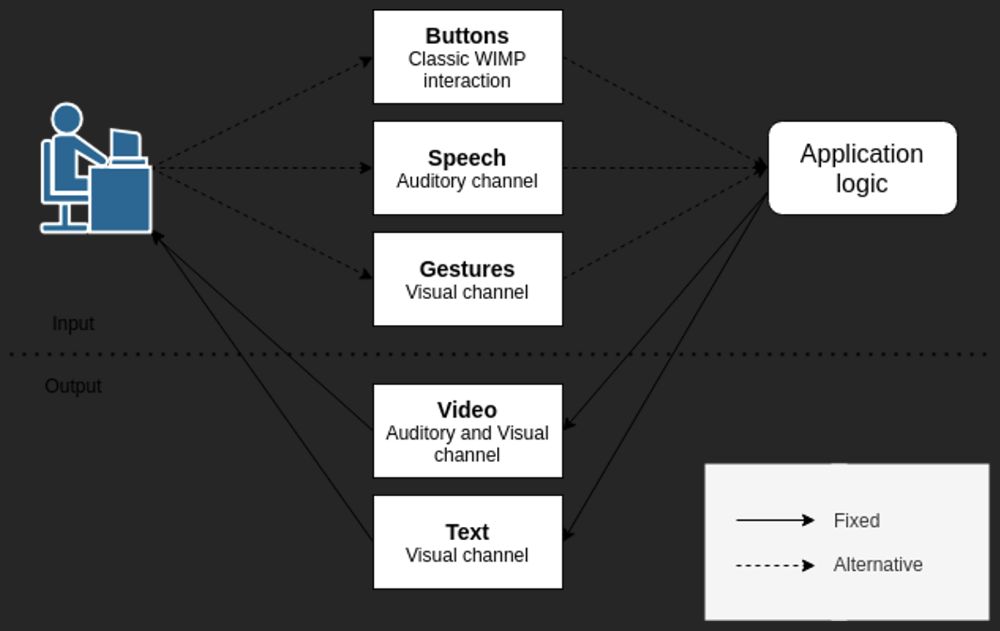
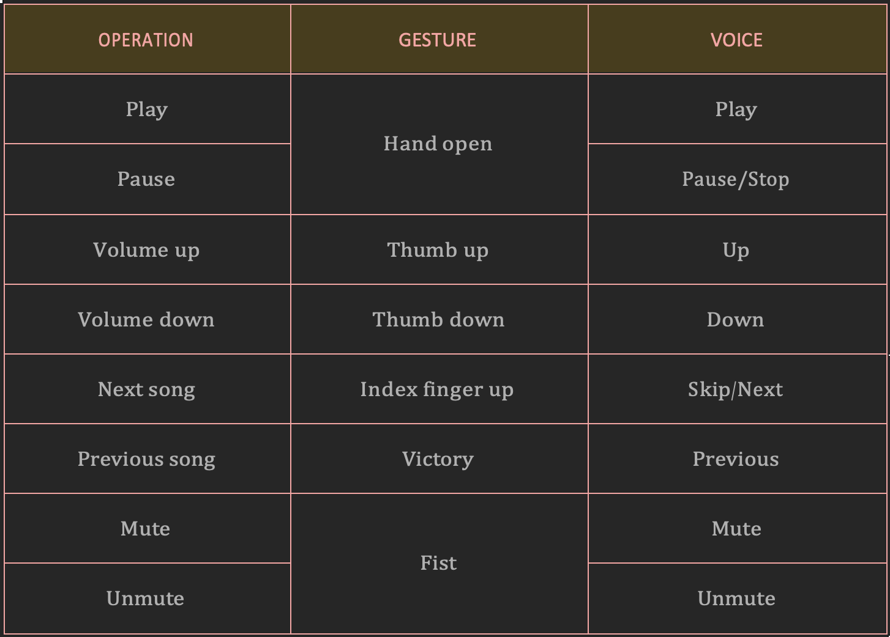

  # Libraries & APIs

To develop our system, we took advantage of existing services such as libraries and APIs (see references). In details:

* **YouTube player**: libvlc, Pafy, youtube-dl, gtk (pyGObject), pydbus, mutagen.
* **Database**: PostgreSQL (psycopg2).
* **Image acquisition**: openCV, gphoto2.
* **Face and Emotion Recognition**: Face++ Face Detection and Search.
* **Gesture Recognition**: Face++ Gesture Recognition.
* **Speech Recognition**: Microsoft Azure Cognitive Services (Speech to Text).

# Dataset 

Unfortunately we had some _limitations_ in testing the application since, due to time constraints and due to the Covid-19, we were not able to see a lot of people.

We **generated** _three custom datasets_ where users have _various_ **ages**, **English proficiency**, and **devices**. Pictures and audios are divided as follows:
* **Identification_and_Emotion**: 31 users with ≥ 3 pictures each for the three possible emotions (neutral, sad, happy) - _103 pics_;
* **Gesture_dataset**: 30 users with ≥ 6 pictures each for the six possible gestures (hand open, thumb up, thumb down, index finger up, victory, fist) _- 187 pics_;
* **Speech_dataset**: 31 users with 1 audio each, in which they pronounce all the possible voice commands (play, pause/stop, up, down, skip/next, previous, mute, unmute) - _31 audios_.
 
The number of pictures and audio is not the same for each dataset since someone decided to give us only the audio, and others captured more than the minimum number of images we asked for. 

# Evaluation

The evaluation was performed on all the different tasks as follows:

* **Open Set Identification**: the user does not claim an identity and the system has to assess if the taken picture matches the face of someone in the gallery:
  * The set of **Genuine Users** consists of 25 random enrolled users (all the genuine users were previously enrolled by using the application);
  * The set of **Impostors** consists of 6 random not enrolled users.
* **Emotion recognition**: the system recognizes the emotion from 103 pics;
* **Semaphoric Gesture** recognition: the system recognizes the gesture from 187 pics;
* **Speech recognition**: the system recognizes the speech from 31 audio.

## Emotion Recognition
The emotion recognition task is a computer-generated paradigm for measuring the recognition of basic facial emotional expressions, in our project we focused on **happiness**, **sadness** and **neutral** expression.

We tested the system on all the 109 available pictures. We got **69%** of Accuracy and, the following is the confusion matrix:

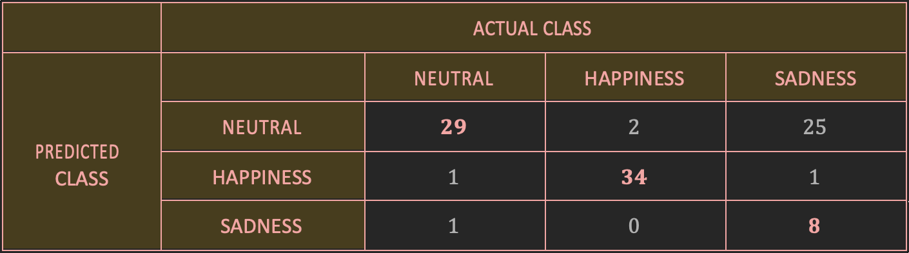

The overall accuracy is quite good, but it changed considerably from class to class. In particular, for _sadness_ it is very lower than for the other classes:

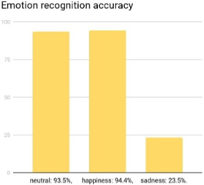

It strictly depends on how much the user that takes the picture “forced” his facial expression to be sad, or not (i.e., a sad expression that is not forced is really hard to recognize). In fact, for example, in the following images, the first one was correctly classified as sad, while the second was considered neutral.

## Gesture Recognition 
In our system, the gesture interaction is based on a **semaphoric style**, meaning that the system employs a stylized dictionary of static or dynamic hand or arm gestures.

Using gestures to interact with the system is that we want our application to be accessible even to **deaf users**. Many deaf people can speak or learn how to speak, but many choose not to speak. In the American Deaf community, some people believe that using speech is a betrayal of Deaf pride and cultural values: speaking indicates that American Sign Language (ASL) is inferior. For some people, the choice is made for them through the circumstances of their education and training approach. For others, it is simply too late (see this [link](https://www.quora.com/Is-it-compulsory-for-a-mute-person-to-be-deaf) for further details).

_Sometimes, not speaking is a natural consequence of deafness; other times, it is a choice._ To **satisfy** and **respect** all the options, we decided to integrate gesture interaction so that people who cannot speak or don't want to, can use gestures to manipulate the player.

We tested the system on all the 187 available pictures. We got **58.82%** of Accuracy and, the following is the confusion matrix:

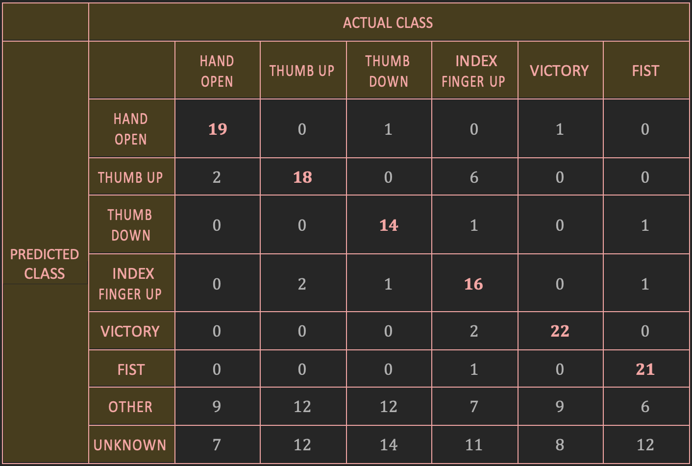

The hardest gesture to recognize was the index finger up. A possible explanation is that a lot of users made a wrong gesture since they created an “L” with their hand instead of raising only the index finger:

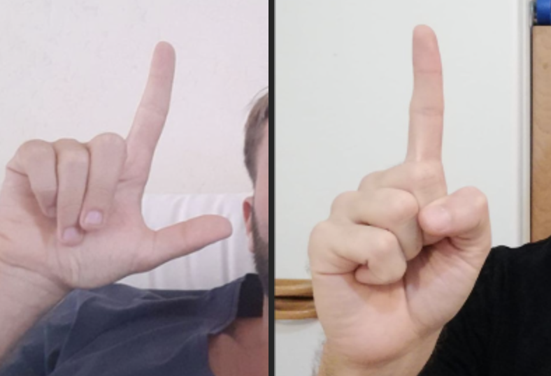

The overall accuracy was not so good this time, and it changed considerably from class to class. In particular, for index finger up and thumb down gestures, it is very low:

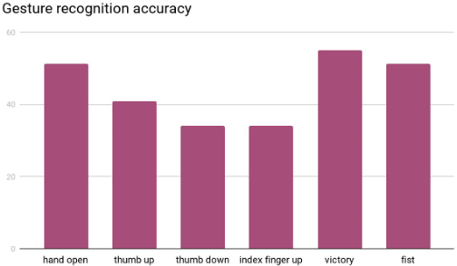

## Voice Recognition
To have a vocal interaction with the system requires speech recognition, in our case, with **semaphoric trigger words** instead of a more articulated composition of them. Our system is an **Isolated** and **Speaker Independence** system, where Isolated means that commands are **single words**. In contrast, Speaker Independence means that the system was not intended for use by a single speaker but by **any speaker**.

We tested the system on all the 31 available registrations that contained all the voice commands, so the total number of voice commands was 310.

We got **81.29%** of Accuracy and **79.68%** of Recognition Accuracy (the number of utterances recognized correctly out of the total number of utterances spoken), and the following is the confusion matrix:

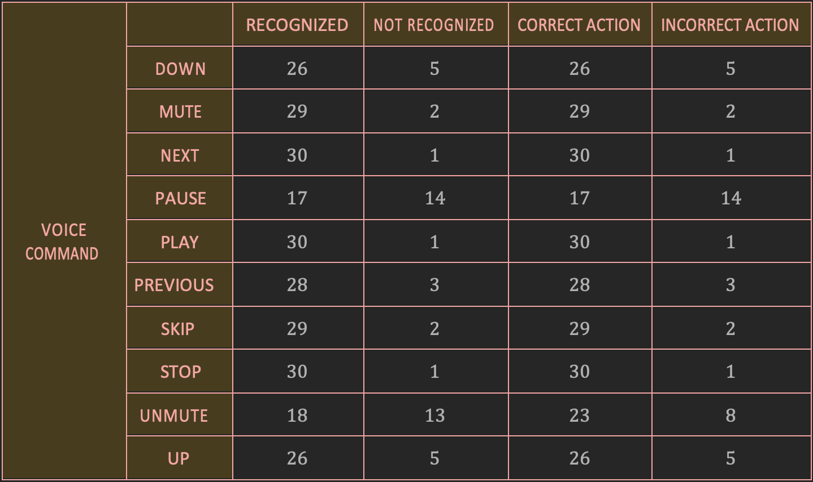

The accuracy was outstanding, and it did not change a lot from command to command. The only utterance that was a little bit problematic was a pause, where the accuracy is relatively lower than for the other voice commands:

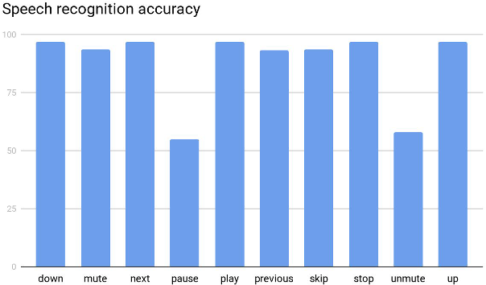

# Demos
We provided two demo available at the following links: [demo user deaf](https://www.youtube.com/watch?v=1lTGk85tQ-8&ab_channel=IreneCannistraci) and [demo user](https://www.youtube.com/watch?v=yjkMG3RedNA&ab_channel=IreneCannistraci) (not deaf).

## Deaf User
The user is **not enrolled**.
1. The user performs the **enrollment** with the username “irene” and checks the “deaf” option.
2. The system correctly **recognized** the mood of the user as **neutral** (the correct one is the first taken picture).
3. The user try the following commands:
   * Gesture “volume up” -> not recognized -> ignored by the system
   * Gesture “pause” -> correctly recognized
   * Gesture “volume down” -> correctly recognized
   * Gesture “play” -> correctly recognized
   * Gesture “next” -> correctly recognized
   * Gesture “volume down” -> wrongly recognized as mute -> mute
   * Gesture “unmute” -> correctly recognized

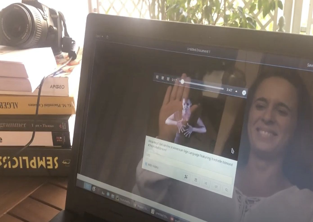

## Not Deaf User
The user is already **enrolled** in the database as “giovanni”.
1.	The system **automatically logs** in the user with the correct identity.
2.	The system correctly **recognized** the mood of the user as **happy**.
3.	The user tried the following commands:
     * Gesture “pause” -> correctly recognized
     * Utterance “play” -> correctly recognized
     * Utterance “skip” -> correctly recognized
     * Gesture “previous” -> correctly recognized
     * Utterance “next” -> correctly recognized
     * Utterance “mute” -> correctly recognized
     * Gesture “unmute” -> correctly recognized
     * Utterance “stop” -> correctly recognized

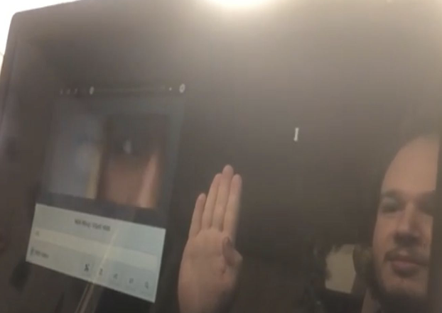

### References
* YouTube player: https://github.com/vn-ki/YoutubePlayer
* GTK toolkit: https://www.gtk.org
* youtube-dl: https://github.com/ytdl-org/youtube-dl
* openCV: https://opencv.org
* gphoto2: http://www.gphoto.org
* PostgreSQL: https://www.postgresql.org
* Face++: https://www.faceplusplus.com/
* Microsoft Azure Speech To Text: https://azure.microsoft.com/en-us/services/cognitive-services/speech-to-text/